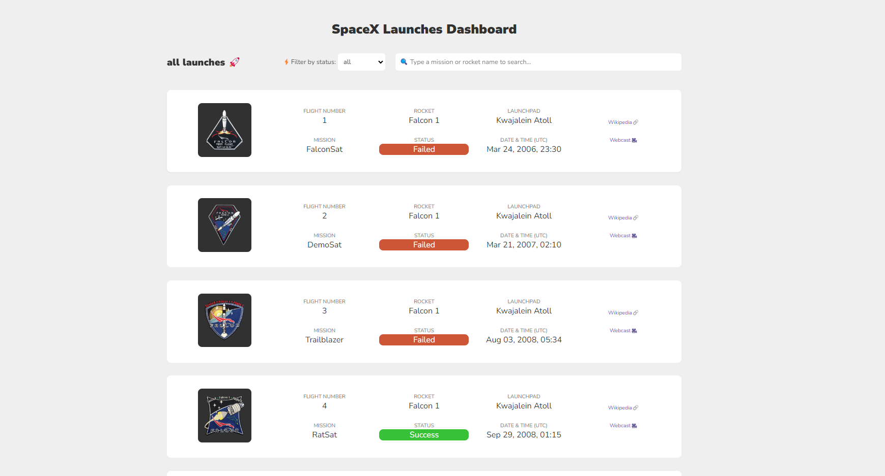

# SpaceX Launches Dashboard 🚀

Welcome to the dashboard of SpaceX launches.



This project is made using ReactJS, ViteJS, TypeScript, CSS modules, ReactQuery, Jest, Testing Library React, Cypress and also has filtering, searching & infinite scroll capabilities which uses the intersection observer concepts.

## Installation

Run `npm install`

## Running the app

Run `npm run dev`, open localhost (check the port number in the terminal) in your browser to enjoy the app! 🚀

## Running unit tests

Run `npm run test`

## Running e2e tests

Run `npm run cypress:open`

## Expanding the ESLint configuration (optional)

If you are developing a production application, we recommend updating the configuration to enable type aware lint rules:

- Configure the top-level `parserOptions` property like this:

```js
export default {
  // other rules...
  parserOptions: {
    ecmaVersion: "latest",
    sourceType: "module",
    project: ["./tsconfig.json", "./tsconfig.node.json"],
    tsconfigRootDir: __dirname,
  },
};
```

- Replace `plugin:@typescript-eslint/recommended` to `plugin:@typescript-eslint/recommended-type-checked` or `plugin:@typescript-eslint/strict-type-checked`
- Optionally add `plugin:@typescript-eslint/stylistic-type-checked`
- Install [eslint-plugin-react](https://github.com/jsx-eslint/eslint-plugin-react) and add `plugin:react/recommended` & `plugin:react/jsx-runtime` to the `extends` list
